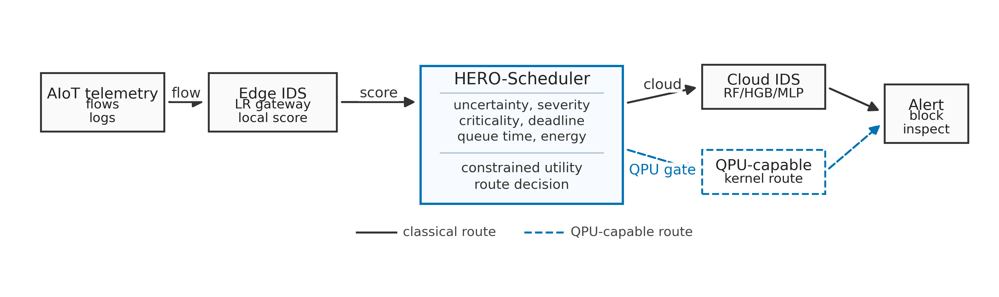
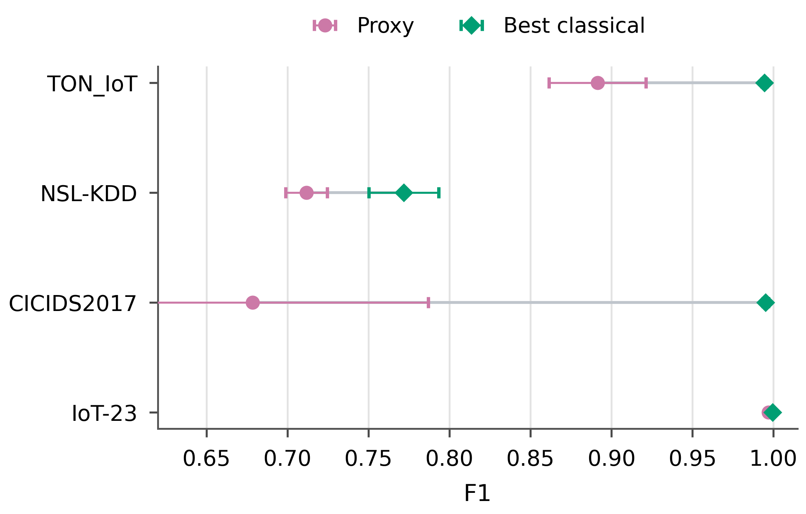
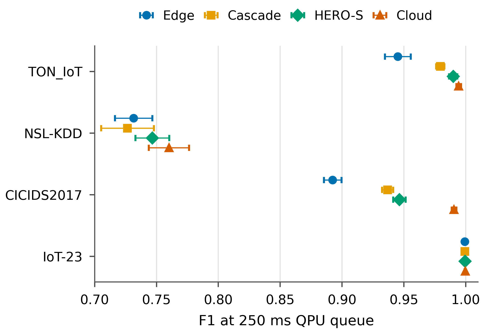
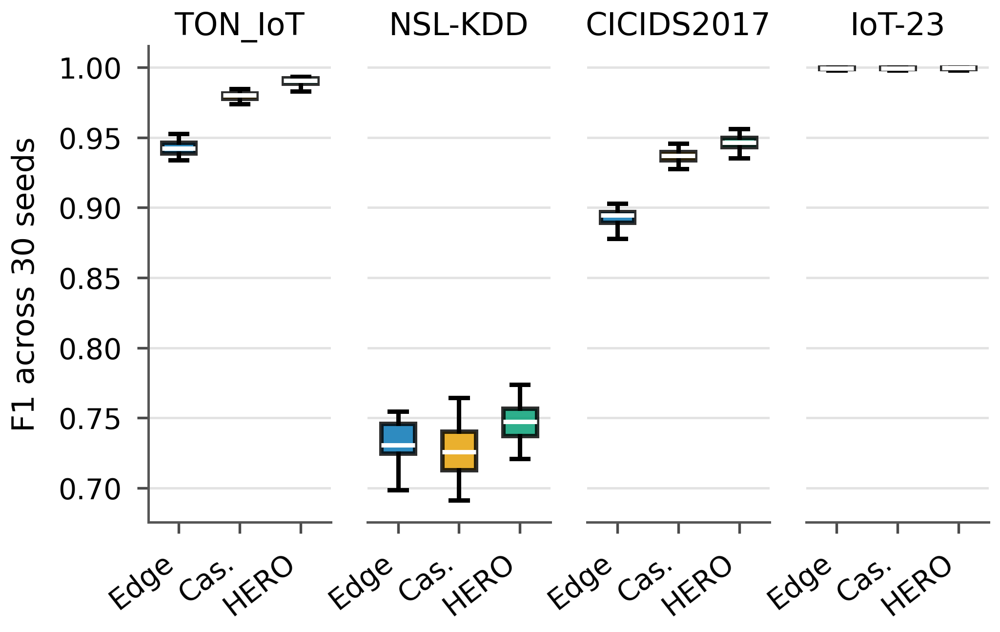
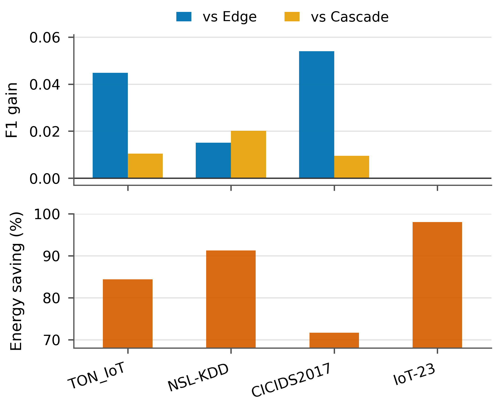
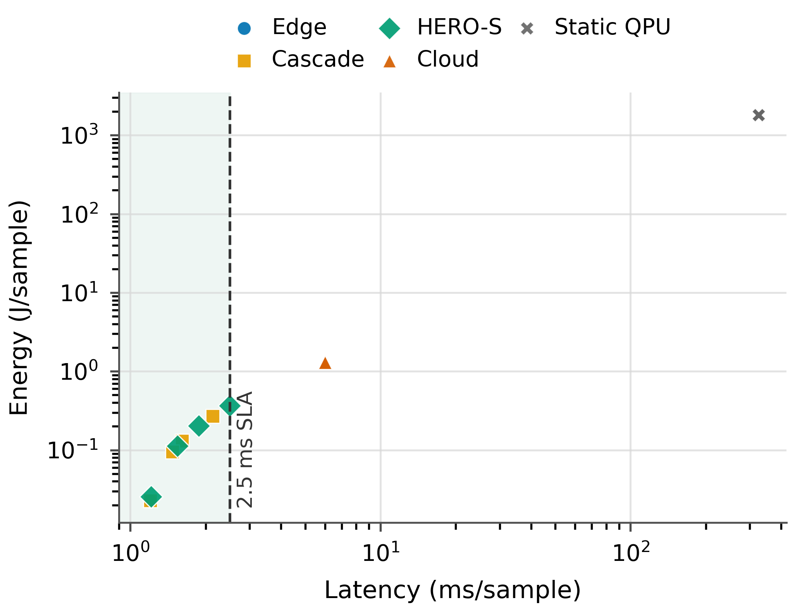
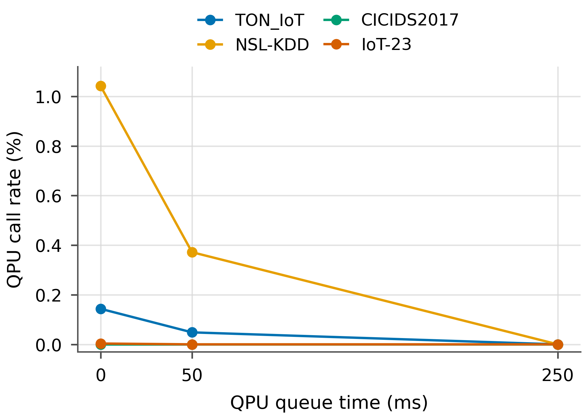

# HERO-S: QPU-Aware Energy-Latency Orchestration for AIoT Intrusion Detection

## Abstract

AIoT intrusion-detection workflows increasingly span edge gateways, cloud AI accelerators, and optional remote quantum services. The systems question is not whether every alert should use a quantum processing unit (QPU), but whether each security task should remain at the edge, escalate to cloud inference, or enter a QPU-capable path under latency, queue-time, and energy constraints. This paper presents HERO-S, a QPU-aware edge-cloud orchestration framework for AIoT intrusion detection. HERO-S annotates tasks with alert severity, asset criticality, uncertainty, response deadline, backend queue time, route confidence, and energy estimates, then applies a constrained routing utility. We evaluate HERO-S on TON_IoT, NSL-KDD, CICIDS2017, and IoT-23 over 30 seeds. The cloud model remains the upper-quality reference but violates a 2.5 ms/sample average gateway budget. Under that budget and 250 ms QPU queue time, HERO-S improves F1 over edge-only and over a closest classical uncertainty-cascade baseline on the three nontrivial datasets, matches near-perfect edge performance on IoT-23, and reduces energy by 71.7-98.0% relative to cloud-only routing. HERO-S also drives QPU use to zero under queue pressure, showing that rejecting low-utility QPU calls is a first-class orchestration outcome.

**Keywords:** AIoT security, intrusion detection, edge-cloud orchestration, QPU-aware scheduling, energy-aware routing.

## I. Introduction

AIoT security pipelines combine local telemetry collection, edge filtering, cloud-based machine learning, and specialized accelerators. HERO-S addresses the decision layer: when should a task stay at the edge, move to cloud inference, or enter a QPU-capable route? The paper does not claim that a current QPU-compatible classifier beats strong unconstrained classical IDS. Instead, it evaluates routing under quality, deadline, queue-time, and energy constraints.

The contributions are: (1) an AIoT edge-cloud-QPU intrusion-detection formulation; (2) HERO-Scheduler, a security-aware route-selection policy using severity, asset criticality, uncertainty, confidence gates, deadlines, queue time, and energy estimates; (3) a 30-seed evaluation on four real IDS datasets; (4) quantitative comparison with a closest classical uncertainty-cascade baseline, including route-call rates, SLA violations, energy, and energy-delay product; and (5) a transparent QPU-proxy methodology that separates scheduler-scale proxy results from small Qiskit quantum-kernel feasibility runs.

## II. Threat and Workload Model

HERO-S assumes an AIoT edge-cloud continuum. IoT devices produce packet or flow telemetry, edge gateways perform normalization and low-cost filtering, cloud CPU/GPU resources run stronger IDS models, and a remote QPU service is available as an optional path. The QPU is not placed on the IoT device; it is a scarce remote service with queue time, shot budget, execution latency, and modeled infrastructure energy.

The defender observes flow telemetry from AIoT devices and gateways. The attacker may generate denial-of-service, scanning, brute-force, botnet, backdoor, infiltration, or web-attack traffic. In the experiments, severity is derived from the edge attack probability, uncertainty is one minus edge confidence, asset criticality is assigned on a 1-5 scale, and deadlines are sampled from representative edge-response classes.

## III. HERO-S Architecture and Scheduler

For each ready task, HERO-Scheduler scores candidate edge, cloud, and QPU-capable routes using expected quality gain, security risk, energy, latency, queue time, and predicted SLA violation. The fixed utility weights are alpha=2.0, beta=1.5, gamma=0.001, delta=0.015, eta=0.01, and zeta=1.0. These are fixed engineering weights: quality and risk dominate while energy, latency, queue time, and SLA violations penalize expensive routes.

HERO-S applies two safety gates. Cloud escalation requires edge uncertainty at least 0.08 and cloud-route confidence at least 0.70, followed by a 2.5 ms/sample average latency-budget check. QPU-capable routing must win the utility score and have a confidence margin over the edge/cloud alternatives.

The closest classical baseline is an uncertainty cascade: run edge first and escalate to cloud when edge uncertainty is at least 0.25. It has no security metadata, QPU awareness, queue term, or energy term. For |V| tasks and |R| routes, HERO-S costs O(|V||R|) time and O(|R|) per-task memory; here |R|=3.

| Policy | What it tests |
| --- | --- |
| Edge-only | Minimum-energy gateway inference; no escalation. |
| Cloud-only | Upper-quality classical reference; violates the average budget. |
| Uncertainty cascade | Closest classical edge-cloud baseline without security or QPU terms. |
| Static QPU | Stress-test baseline that always takes the QPU-capable route. |
| HERO-S | Security-aware, confidence-gated, queue-aware route selection. |

## IV. Experimental Methodology

| Dataset | Samples | Features | Normal | Attack | Attack ratio |
| --- | ---: | ---: | ---: | ---: | ---: |
| TON_IoT | 20,000 | 40 | 10,000 | 10,000 | 0.500 |
| NSL-KDD | 7,000 | 41 | 3,500 | 3,500 | 0.500 |
| CICIDS2017 | 40,000 | 78 | 25,818 | 14,182 | 0.355 |
| IoT-23 | 10,035 | 15 | 7,200 | 2,835 | 0.283 |

TON_IoT is stratified-sampled to 20,000 rows. CICIDS2017 is sampled from all eight daily parquet files with up to 5,000 rows per file. NSL-KDD uses standard train/test files with stratified caps. IoT-23 drops IP, UID, detailed label, and scenario fields to reduce leakage.

Classical IDS baselines are Logistic Regression, RBF-SVM, Random Forest, Histogram Gradient Boosting, and MLP. The edge route uses Logistic Regression because it has a compact linear decision rule and small memory footprint suitable for gateway inference, while the cloud route uses Random Forest as a stronger ensemble reference with larger model state. Scheduler-scale QPU behavior is represented by a four-feature reduced-kernel proxy. This proxy is a classical stand-in for a QPU-compatible kernel path; it is not a hardware QSVM result and is not used as evidence of quantum advantage. Small Qiskit quantum-kernel subsets validate implementation feasibility only.

Metrics include F1, ROC-AUC, PR-AUC, FPR, FNR, latency/sample, energy/sample, EDP, route-call rates, sampled-deadline violation rate, and average-budget violation. The 2.5 ms/sample constraint is a representative average gateway compute budget used to stress-test latency-sensitive edge operation, not a universal hard real-time standard. CPU/GPU energy uses RAPL/NVML counters when available and otherwise a labeled fallback model. QPU infrastructure energy is modeled only and used for scheduling sensitivity.

| Route | Latency | Energy | Source |
| --- | ---: | ---: | --- |
| Edge CPU | 1.2 ms | 0.0227 J | RAPL if available; fallback model otherwise. |
| Cloud CPU/GPU | 6.0 ms | 1.296 J | NVML/RAPL if available; fallback model otherwise. |
| QPU-capable | 75-325 ms | 1800 J | Modeled infrastructure sensitivity only. |

## V. Results

### A. Complete IDS Baseline Comparison

| Dataset | Model | Acc. | F1 | Recall | FPR | FNR | ROC-AUC | PR-AUC |
| --- | --- | ---: | ---: | ---: | ---: | ---: | ---: | ---: |
| TON_IoT | LR | 0.944 | 0.945 | 0.966 | 0.079 | 0.034 | 0.991 | 0.991 |
| TON_IoT | RBF-SVM | 0.973 | 0.973 | 0.968 | 0.022 | 0.032 | 0.982 | 0.986 |
| TON_IoT | RF | 0.994 | 0.994 | 0.996 | 0.007 | 0.004 | 1.000 | 1.000 |
| TON_IoT | HGB | 0.995 | 0.995 | 0.995 | 0.006 | 0.005 | 1.000 | 1.000 |
| TON_IoT | MLP | 0.978 | 0.978 | 0.968 | 0.012 | 0.032 | 0.994 | 0.994 |
| TON_IoT | Proxy | 0.889 | 0.891 | 0.906 | 0.128 | 0.094 | 0.916 | 0.899 |
| NSL-KDD | LR | 0.772 | 0.732 | 0.620 | 0.076 | 0.380 | 0.858 | 0.876 |
| NSL-KDD | RBF-SVM | 0.789 | 0.747 | 0.622 | 0.044 | 0.378 | 0.893 | 0.908 |
| NSL-KDD | RF | 0.801 | 0.760 | 0.630 | 0.027 | 0.370 | 0.961 | 0.956 |
| NSL-KDD | HGB | 0.809 | 0.772 | 0.646 | 0.027 | 0.354 | 0.952 | 0.946 |
| NSL-KDD | MLP | 0.789 | 0.755 | 0.652 | 0.075 | 0.348 | 0.873 | 0.889 |
| NSL-KDD | Proxy | 0.763 | 0.712 | 0.586 | 0.061 | 0.414 | 0.829 | 0.874 |
| CICIDS2017 | LR | 0.888 | 0.892 | 0.929 | 0.153 | 0.071 | 0.944 | 0.934 |
| CICIDS2017 | RBF-SVM | 0.906 | 0.911 | 0.956 | 0.143 | 0.044 | 0.960 | 0.944 |
| CICIDS2017 | RF | 0.991 | 0.991 | 0.990 | 0.009 | 0.010 | 0.999 | 0.998 |
| CICIDS2017 | HGB | 0.995 | 0.995 | 0.996 | 0.005 | 0.004 | 0.999 | 0.999 |
| CICIDS2017 | MLP | 0.952 | 0.953 | 0.973 | 0.068 | 0.027 | 0.989 | 0.987 |
| CICIDS2017 | Proxy | 0.744 | 0.679 | 0.567 | 0.078 | 0.433 | 0.804 | 0.840 |
| IoT-23 | LR | 0.999 | 0.999 | 0.999 | 0.001 | 0.001 | 1.000 | 0.999 |
| IoT-23 | RBF-SVM | 1.000 | 0.999 | 0.999 | 0.000 | 0.001 | 1.000 | 1.000 |
| IoT-23 | RF | 1.000 | 1.000 | 0.999 | 0.000 | 0.001 | 1.000 | 1.000 |
| IoT-23 | HGB | 1.000 | 1.000 | 0.999 | 0.000 | 0.001 | 1.000 | 1.000 |
| IoT-23 | MLP | 0.999 | 0.999 | 0.998 | 0.000 | 0.002 | 0.999 | 0.999 |
| IoT-23 | Proxy | 0.997 | 0.997 | 0.994 | 0.000 | 0.006 | 1.000 | 1.000 |

Strong classical models, especially RF and HGB, are the best quality references. The reduced-kernel proxy is weakest on CICIDS2017, which motivates QPU-aware route admission based on expected utility.

### B. Closest-Baseline Scheduler Comparison

| Dataset | Edge F1 | Cascade F1 | HERO-S F1 | Cloud F1 | HERO latency | HERO energy | EDP | Edge/Cloud/QPU | Deadline violation | p vs Cascade |
| --- | ---: | ---: | ---: | ---: | ---: | ---: | ---: | --- | ---: | ---: |
| TON_IoT | 0.945 | 0.979 | 0.990 +/- 0.003 | 0.994 | 1.878 ms | 0.203 J | 0.383 | 0.859/0.141/0.000 | 0.021 | 1.86e-9 |
| NSL-KDD | 0.732 | 0.727 | 0.747 +/- 0.014 | 0.760 | 1.541 ms | 0.113 J | 0.175 | 0.929/0.071/0.000 | 0.011 | 3.54e-8 |
| CICIDS2017 | 0.892 | 0.937 | 0.946 +/- 0.005 | 0.991 | 2.498 ms | 0.367 J | 0.917 | 0.730/0.270/0.000 | 0.040 | 4.66e-8 |
| IoT-23 | 0.999 | 0.999 | 1.000 +/- 0.001 | 1.000 | 1.211 ms | 0.0256 J | 0.031 | 0.998/0.002/0.000 | 0.00045 | 1.60e-2 |

At 250 ms QPU queue time, HERO-S satisfies the 2.5 ms/sample average gateway budget, avoids QPU calls, improves F1 over both edge-only and the uncertainty cascade on the three nontrivial datasets, and achieves only marginal additional F1 on the near-saturated IoT-23 setting. NSL-KDD illustrates why a fixed uncertainty cascade is not sufficient by itself: its 0.25 rule escalates a small subset whose cloud predictions do not consistently improve the edge decision, so cascade F1 can fall below edge-only despite the cloud model being stronger on average. The zero QPU rate is the intended behavior: the current proxy is lower quality than the classical alternatives and the 250 ms queue alone violates the edge budget. On IoT-23, all policies are already near perfect, so the numerical F1 difference is operationally negligible; this confirms that HERO-S avoids unnecessary route changes when edge detection is sufficient.

### C. Energy-Latency Tradeoff and QPU Queue Sensitivity

Compared with cloud-only routing, HERO-S reduces energy by 84.4% on TON_IoT, 91.3% on NSL-KDD, 71.7% on CICIDS2017, and 98.0% on IoT-23. Its EDP remains far below cloud-only: 0.383, 0.175, 0.917, and 0.031 versus 7.776 for cloud-only. Static QPU routing has EDP 5.85e5 at 250 ms queue time and serves as the stress-test baseline.

At zero queue, HERO-S invokes the QPU-capable path for 0.001 of TON_IoT samples, 0.010 of NSL-KDD samples, 0.000 of CICIDS2017 samples, and almost none on IoT-23. At 50 ms, these rates drop to 0.0005 on TON_IoT, 0.0037 on NSL-KDD, and zero or nearly zero on the other datasets. At 250 ms, QPU calls drop to zero on all datasets.

### D. Qiskit Subset

The Qiskit subset validates implementation feasibility only. TON_IoT noiseless F1 is 0.804 +/- 0.120; NSL-KDD noiseless F1 is 0.821 +/- 0.062. Accuracy is quantized because each run uses only eight balanced test samples; the same 6/7/7-correct pattern across three seeds yields the repeated 0.833 +/- 0.072 accuracy, while F1 differs because the class-error mix differs. Identical noiseless and low-noise labels on these tiny subsets indicate that the injected simulator noise did not flip the final SVM decision for the sampled points.

## VI. Discussion

HERO-S provides constrained route selection for AIoT security pipelines. Under an average gateway-latency budget, it improves over the closest uncertainty cascade, adapts to backend queue time, and assigns low-utility QPU-capable tasks to classical routes. At 250 ms queue time, the utility model assigns zero traffic to the QPU-capable path; at zero queue, the same policy admits QPU-capable routing on TON_IoT and NSL-KDD. Future improvements in QPU kernels or backend queues can therefore be integrated through the existing utility and confidence gates.

For deployment, the scheduler can run at an edge gateway or site controller because it requires only normalized flow features, model confidence, metadata, and backend telemetry. Each nonlocal decision can be explained by uncertainty, alert severity, asset criticality, confidence margin, queue time, and remaining latency budget. A controller alert, botnet flow, and low-risk sensor event should therefore not consume accelerator resources in the same way. The fixed weights and gates are held constant across datasets, so the reported gains are not produced by per-dataset retuning; production deployments could calibrate them against operator costs for false negatives, false positives, cloud usage, and remote accelerator access.

The route interface also separates orchestration policy from classifier choice. The edge model could be replaced by a compact tree, linear SVM, or tiny neural detector; the cloud route could use a deeper ensemble or GPU model; and the QPU-capable route could be upgraded from the reduced-kernel proxy to a hardware-backed kernel. HERO-S needs the same route contract in each case: estimated confidence, latency, energy, queue state, and expected quality gain.

The energy model uses a fixed route-cost table. Edge and cloud energy are measured when RAPL/NVML counters are available and otherwise use the labeled fallback route model; in this paper the per-route values are fixed stress-test costs rather than dataset-specific power traces. QPU infrastructure energy is modeled only. They separate scheduler sensitivity from direct per-job QPU facility telemetry.

## VII. Related Work

IDS datasets and metrics: AIoT and industrial IoT security surveys motivate heterogeneous devices, edge analytics, and AI-based defenses, while TON_IoT, IoT-23, CICIDS2017, and NSL-KDD cover complementary benchmark settings. Deep-learning and IoT IDS: deep IDS surveys, Kitsune, N-BaIoT, software-defined IoT IDS, federated IoT IDS, and cloud-edge IoT IDS show that strong classical baselines remain essential. Edge-cloud orchestration: edge computing, MEC, edge intelligence, energy-aware scheduling, and offloading studies motivate placing latency-sensitive computation near devices and reporting quality with cost. Quantum-aware security workflows: HERO-S treats QPU-capable kernels as optional candidate routes whose use must be justified by security utility, latency, queue time, confidence, and modeled energy.

## VIII. Conclusion

HERO-S is a QPU-aware energy-latency orchestration framework for AIoT intrusion detection. The evaluation shows that unconstrained cloud IDS remains the best quality reference, while HERO-S is useful under strict gateway budgets where cloud-only execution is infeasible. At 250 ms QPU queue time, HERO-S improves over edge-only and over a closest uncertainty-cascade baseline on TON_IoT, NSL-KDD, and CICIDS2017, matches the near-perfect IoT-23 edge result, reduces energy relative to cloud-only execution, and drives QPU calls to zero. The result is an auditable scheduling policy for deciding when QPU-capable execution is used, deferred, or avoided.
